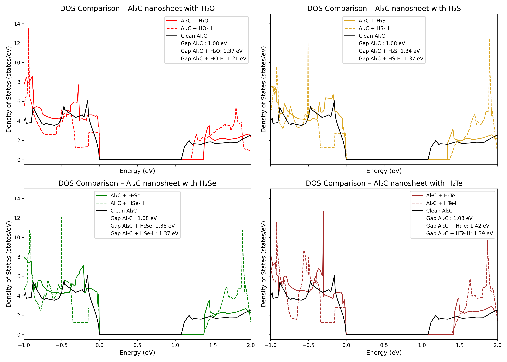

# Density of States analysis on the interaction of H₂X molecules with Al₂C nanosheet (X = O, S, Se, Te)

This project performs a comparative analysis of the **Density of States (DOS)** for the interaction of H₂X molecules with the Al₂C nanosheet (X = O, S, Se, Te).
The datasets (DOSCAR files) were obtained after DFT calculations with the VASP code (Vienna Ab initio Simulation Package).
The studied systems are: a clean Al₂C nanosheet and the Al₂C nanosheet interacting with the molecules H₂O, H₂S, H₂Se and H₂Te.
DOS of molecular adsorptions (Al₂C + H₂X) and partial dissociation (Al₂C + HX-H) are calculated. 
The goal is to investigate how the adsorption affect the electronic properties of the systems, particularly the band gap of Al₂C.

> 🧪 **This project is part of the research published in:**
>
> Nahuel Moreno Yalet, Víctor Ranea.  
> _A density functional theory research on the interaction of H₂X molecules with the Al₂C nanosheet (X = O, S, Se, Te)_.  
> **Next Materials**, Volume 4, July 2024, 100114.  
> [https://doi.org/10.1016/j.nxmate.2024.100114](https://doi.org/10.1016/j.nxmate.2024.100114)

## 🔬 Systems Analyzed

The following systems were analyzed:

- Clean Al₂C
- Al₂C + H₂O
- Al₂C + HO-H
- Al₂C + H₂S
- Al₂C + HS-H
- Al₂C + H₂Se
- Al₂C + HSe-H 
- Al₂C + H₂Te
- Al₂C + HTe-H 

## 📁 Files

- `DOS-Al2C-H2X.ipynb`: Main Jupyter Notebook for plotting and comparing DOS.
- `DOSCAR_*`: VASP output files used to extract total DOS information for each system.

## 📊 Methodology
- DOSCAR files were generated with VASP code after DFT calculations. HSE06 hybrid functional was used. 
- DOS data was extracted from `DOSCAR` files using a custom `read_doscar()` function.
- Band gap values were computed for each system.
- Subplots (2×2) visualize the DOS comparison between:
  - Clean Al₂C 
  - Molecular adsorptions (Al₂C + H₂X)
  - Partial dissociation (Al₂C + HX-H)
- The band gap for each configuration is included in the legend of each plot.
- The X-axis is limited to -1 eV to 2 eV to focus on the region around the Fermi level.

## 🖼️ DOS Comparison Plot

Each subplot includes:
- Solid line: DOS of H₂X adsorbed on Al₂C
- Dashed line: DOS of dissociated HX-H configuration on Al₂C 
- Black line: DOS of clean Al₂C
- The band gap values for each configuration are shown in the legend

## ⚙️ Requirements

- Python ≥ 3.8
- matplotlib

## 🧠 Conclusions

The calculated energy gap for the pristine Al₂C nanosheet is 1.078 eV. However, it increases significantly to 1.371, 1.338, 1.379 and 1.416 eV for molecular adsorption (H₂O, H₂S, H₂Se and H₂Te, respectively) and to 1.209, 1.363, 1.370 and 1.388 eV for partial dissociative adsorption.
The increase in the energy gap means the electrical conductivity decreases. Because the conductivity can be measure by sensors, these results could be considered as an indication that the Al₂C nanosheet has a potential use as a sensor for these molecules in molecular or dissociated state. However, experiments and experimental results are needed in order to reach definitive conclusions.

## 📚 Citation

If you use or reference this project, please cite the related article:

Nahuel Moreno Yalet, Víctor Ranea.
A density functional theory research on the interaction of H₂X molecules with the Al₂C nanosheet (X = O, S, Se, Te).
Next Materials, Volume 4, July 2024, 100114.
https://doi.org/10.1016/j.nxmate.2024.100114

## 👤 Author

Nahuel Moreno Yalet, Víctor Ranea 

